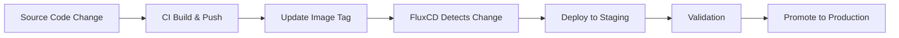

# ReplayWeb.page Kubernetes Infrastructure

This repository contains the Kubernetes manifests and FluxCD GitOps configuration for deploying [ReplayWeb.page](https://github.com/webrecorder/replayweb.page) to Kubernetes clusters.

## Architecture Overview

ReplayWeb.page is deployed as a containerized static web application with:
- **nginx** serving static assets
- **HTTPS termination** (required for service workers)
- **Multi-environment support** (staging/production)
- **GitOps deployment** with FluxCD

## Directory Structure

```
├── docker/                 # Container configuration
│   ├── Dockerfile          # Multi-stage build
│   ├── nginx.conf          # nginx configuration
│   └── .dockerignore       # Docker ignore patterns
├── k8s/                    # Kubernetes manifests
│   ├── base/               # Base resources
│   │   ├── namespace.yaml
│   │   ├── deployment.yaml
│   │   ├── service.yaml
│   │   ├── ingress.yaml
│   │   └── kustomization.yaml
│   └── overlays/           # Environment-specific overrides
│       ├── staging/
│       └── production/
├── flux/                   # FluxCD configuration
│   ├── sources/            # Git source definitions
│   ├── apps/               # Application deployments
│   └── clusters/           # Cluster-specific config
└── .github/workflows/      # CI/CD pipelines
```

## Prerequisites

1. **Kubernetes cluster** with:
   - NGINX Ingress Controller
   - cert-manager (for TLS certificates)
   - FluxCD v2 installed

2. **DNS configuration**:
   - `staging.libutk.com` → staging environment
   - `libutk.com` → production environment

3. **Container registry** access (GitHub Container Registry used by default)

## Quick Start

### 1. Fork and Clone

```bash
# Fork this repository to your GitHub account
git clone https://github.com/yourusername/replayweb-infrastructure.git
cd replayweb-infrastructure
```

### 2. Configure Domains

Update the following files with your domains:
- `k8s/base/ingress.yaml`
- `k8s/overlays/staging/ingress-patch.yaml`
- `k8s/overlays/production/ingress-patch.yaml`

### 3. Configure Git Sources

Update `flux/sources/replayweb-source.yaml` with your infrastructure repository URL.

### 4. Bootstrap FluxCD

```bash
# Install FluxCD CLI
curl -s https://fluxcd.io/install.sh | sudo bash

# Bootstrap FluxCD in your cluster
flux bootstrap github \
  --owner=yourusername \
  --repository=replayweb-infrastructure \
  --branch=main \
  --path=flux/clusters/staging
```

## Deployment Process

### Staging Environment

1. **Automatic deployment** on main branch commits
2. **Staging domain**: `staging.libutk.com`
3. **Resources**: 1 replica, reduced resource limits
4. **Purpose**: Testing and validation

### Production Environment

1. **Manual promotion** from staging
2. **Production domain**: `libutk.com`  
3. **Resources**: 3 replicas, higher resource limits
4. **Purpose**: Live environment

### GitOps Workflow



## Container Build

Images are automatically built and pushed via GitHub Actions:

- **Triggers**: Push to main, PR creation, tag creation
- **Registry**: GitHub Container Registry (`ghcr.io`)
- **Platforms**: linux/amd64, linux/arm64
- **Tagging**: Semantic versioning + branch/SHA tags

## Security Features

### Container Security
- Non-root user (nginx:101)
- Read-only root filesystem
- Resource limits enforced
- Security context applied

### Network Security
- HTTPS enforcement (TLS redirect)
- CORS headers configured
- Rate limiting (production)
- Security headers applied

### Kubernetes Security
- Network policies (recommended)
- Pod security standards
- RBAC configured via FluxCD

## Monitoring & Health Checks

### Application Health
- **Liveness probe**: `/health` endpoint
- **Readiness probe**: `/health` endpoint
- **Health check interval**: 30s

### FluxCD Monitoring
```bash
# Check FluxCD status
flux get all

# Check specific kustomization
flux get kustomizations replayweb-staging

# View logs
flux logs --kind=Kustomization --name=replayweb-staging
```

## Customization

### Resource Scaling

Update replica counts and resource limits in overlay files:
- `k8s/overlays/staging/deployment-patch.yaml`
- `k8s/overlays/production/deployment-patch.yaml`

### Environment Variables

Add environment-specific configurations via Kustomize patches.

### Additional Services

Extend base manifests or add new resources to overlays as needed.

## Troubleshooting

### Common Issues

1. **Service Worker Not Working**
   - Ensure HTTPS is properly configured
   - Check TLS certificate status
   - Verify nginx CORS headers

2. **FluxCD Not Syncing**
   ```bash
   # Force reconciliation
   flux reconcile kustomization replayweb-staging
   
   # Check source status
   flux get sources git
   ```

3. **Build Failures**
   - Check GitHub Actions logs
   - Verify container registry permissions
   - Ensure source repository access

### Debugging Commands

```bash
# Check pod status
kubectl get pods -n replayweb

# View pod logs  
kubectl logs -n replayweb deployment/staging-replayweb-page

# Describe ingress
kubectl describe ingress -n replayweb

# Check certificate status
kubectl get certificates -n replayweb
```

## Development

### Local Testing

Test Kustomize configurations locally:
```bash
# View staging manifest
kubectl kustomize k8s/overlays/staging

# View production manifest  
kubectl kustomize k8s/overlays/production
```

### Local Container Build

```bash
# Clone source repository
git clone https://github.com/webrecorder/replayweb.page.git

# Build container
docker build -f docker/Dockerfile -t replayweb-page:local replayweb.page/

# Run locally
docker run -p 8080:80 replayweb-page:local
```

## Contributing

1. Fork this repository
2. Create a feature branch
3. Make your changes
4. Test with staging environment
5. Submit a pull request

## License

This infrastructure configuration is provided under the same license as ReplayWeb.page (AGPL-3.0-or-later).

## Support

For issues related to:
- **ReplayWeb.page application**: [webrecorder/replayweb.page](https://github.com/webrecorder/replayweb.page)
- **Infrastructure/deployment**: Open an issue in this repository